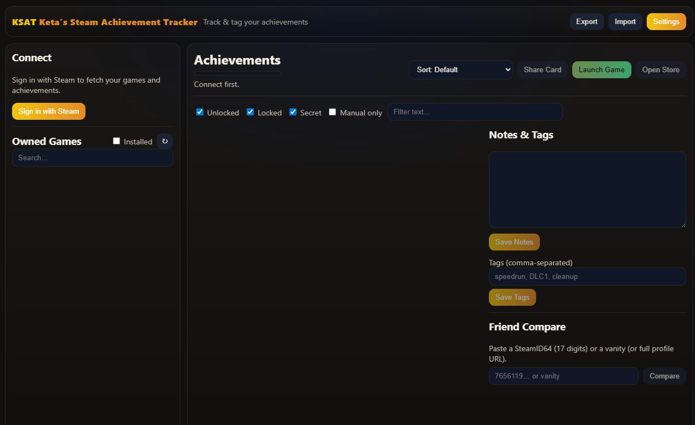
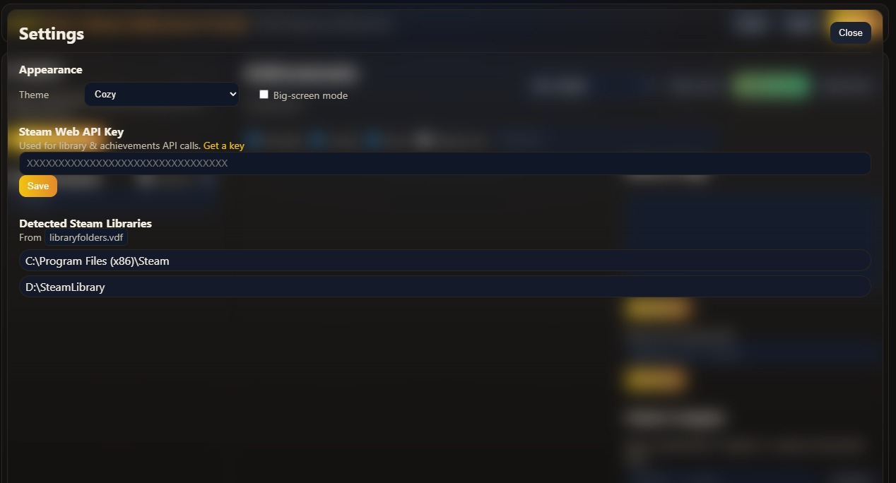
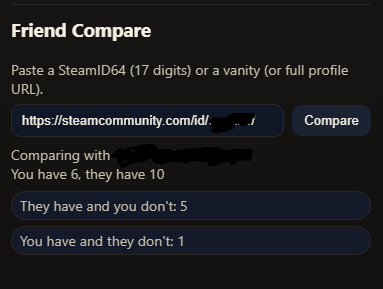

# KSAT — Keta’s Steam Achievement Tracker

KSAT helps you **track, tag, and compare** Steam achievements.

---

## ⬇️ Get KSAT

- Download the latest version from **GitHub → Releases** (recommended):
  - **Installer**: `KSAT_*_x64-setup.exe` — adds Start-menu entry and proper uninstaller.
  - **Portable**: `ksat.exe` — no install; just run.
- We include a **SHA256** checksum in the release to verify your download.

---

## 🌟 What KSAT does

- **Fetch your Steam library** (with an **Installed** toggle)
- **Show achievements per game** with rarity, secret markers, description, and filtering
- **Manual checkboxes** so you can track custom goals (offline play, console ports, mod runs, etc.)
- **Notes & tags per game** to plan backlog, DLC cleanup, or speedruns
- **Friend compare** — paste a SteamID64, vanity, or profile URL and see who’s missing what
- **Share card** — export a simple progress PNG for social/Discord
- **Import/Export** — back up your KSAT data locally

> KSAT talks directly to the **Steam Web API** and stores your notes/tags **on your PC**.

---

## 🖼️ Screenshots

### Home (Library + Achievements)

### Settings

### Friend Compare

---

## 🚀 Getting Started (Windows)

1. **Run** the installer or the portable `ksat.exe` you downloaded from Releases.
2. Open **Settings** (top-right) → click **Get a key** to open Steam’s API key page.
3. **Sign in to Steam** in your browser, create or copy your **Web API Key**, and paste it into KSAT. Click **Save**.
4. Back on the left, click **Sign in with Steam**.  
   After you complete sign-in, KSAT shows your **SteamID64** and starts fetching your library.

> To let KSAT see your owned games, set your Steam **Privacy → Game details** to **Public** (you can change it back later).

---

## 🎮 Using KSAT

- **Browse & search** your games in the left sidebar. Toggle **Installed** to narrow the list.
- **Pick a game** to see its achievements. Use filters: **Unlocked**, **Locked**, **Secret**, **Manual only**, plus text search.
- **Check achievements manually** when you want to track goals outside the API.
- **Notes & Tags**: write notes and add comma‑separated tags (e.g., `speedrun, DLC1, cleanup`), then **Save**.
- **Friend compare**: paste a **SteamID64**, a vanity name, or a full profile URL, then press **Compare**.  
  You’ll see “They have and you don’t” vs “You have and they don’t.”
- **Share card**: click **Share Card** to export a simple PNG of your current progress.
- **Import/Export**: use the top‑right buttons to back up or move your KSAT data between machines.

---

## 💡 Tips

- Some titles don’t expose achievements via the public API; those will show **No achievements found**.
- Hover **tooltips** in the UI explain things like rarity and secret badges.
- Try **Big‑screen mode** in **Settings** to enlarge UI elements for couch/TV use.
- Switch **Theme** in **Settings** any time for a different look.

---

## ❓ FAQ

**Do I need a Steam Web API key?**  
Yes. KSAT uses it to fetch your library and achievement data. You only need to set it **once**.

**Where is my KSAT data stored?**  
Locally on your PC (notes, tags, manual checks). No servers, no accounts.

**Can I use KSAT offline?**  
You can view your last fetched data and edit notes/tags/checks. Online access is required to refresh library/achievements.

**Does KSAT modify my Steam account or unlock achievements?**  
No. KSAT is read‑only. It’s for **tracking** and planning.

---

## 🔐 Privacy

- Your notes/tags and configuration are stored locally.
- The app calls the **Steam Web API** to read publicly available data only.
- No telemetry and no third‑party analytics.

---

## 🧭 Troubleshooting

- **Owned games list is empty** → In Steam **Privacy**, set **Game details** to **Public**, verify your **API key**, then click **Refresh**.
- **Sign‑in opens blank or doesn’t return** → Complete the sign‑in in your **default browser**, then return to KSAT. Ensure the Microsoft **WebView2 Runtime** is installed.
- **Friend compare doesn’t work** → Ask for their **SteamID64** or copy their full profile URL.
- **UI scale / readability** → Try a different **Theme** or enable **Big‑screen mode** in **Settings**.

If you get stuck, open an issue with a short description and a screenshot of what you clicked right before the problem.

---

## 📦 Distributing KSAT

- We publish builds on the **Releases** page. Link users there instead of the repository ZIP.
- Prefer the **installer** for end‑users; the **portable exe** is great for power users and quick tests.
- Each release may include **SHA256** checksums for verification.

---

## 🙌 Credits

- Built with [Tauri](https://tauri.app/), [React](https://react.dev/), and [Vite](https://vitejs.dev/)
- Uses the public [Steam Web API](https://developer.valvesoftware.com/wiki/Steam_Web_API)

---

 
